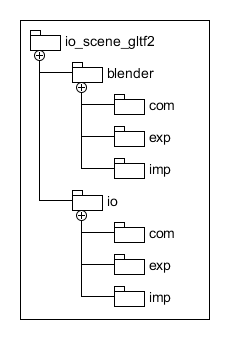

   

Blender glTF 2.0 Importer and Exporter
======================================

Version
-------

Under development

Credits
-------

Developed by [UX3D](http://www.ux3d.io/) and [Julien Duroure](http://julienduroure.com/), with support from the [Khronos Group](https://www.khronos.org/), [Mozilla](https://www.mozilla.org/), and [Airbus Defense & Space](https://www.airbus.com/space.html).

Introduction
------------
This is the official Khronos Blender glTF 2.0 importer and exporter. Goal is to merge and maintain the Blender glTF importer and exporter in one place. Furthermore, the shared code base is organised in Blender dependent and independent packages:  

  
Package organisation  

Advantage of this is, that a later migration from Blender 2.79 to 2.80 can be done with minimal effort. Finally, the generic packages can be used for other Python based glTF 2.0 importers and exporters.  

  
Import & export process

Main importer and exporter interface is the Python glTF scene representation.  
Blender scene data is first extracted and converted into this scene description. This glTF scene description is exported to the final JSON glTF file. Any compression e.g. mesh, animation or texture data happens here.  
For the import, first the glTF data is parsed and written into the Python glTF scene description. Any decompression is executed in this step. Using the imported glTF scene tree, the Blender internal scene representation is generated from this information.  

Until this project is ready, please use the separate [export](https://github.com/KhronosGroup/glTF-Blender-Exporter) and [import](https://github.com/julienduroure/gltf2-blender-importer) addons.  

Installation
------------
The Khronos glTF 2.0 importer and exporter is not available in the *Add-ons* tab by default, and must be installed manually by copying the `addons/io_scene_gltf2` folder into the `scripts/addons/` directory of the Blender installation, then enabling it under the *Add-ons* tab.
